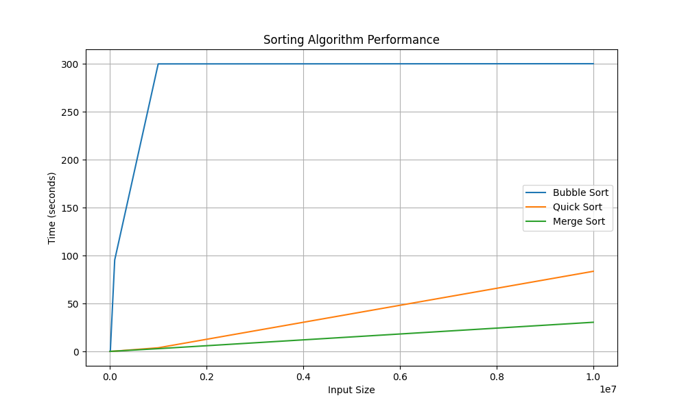

# Sorting Algorithm Performance Benchmark

This repository contains C++ and Python programs to benchmark and visualize the performance of three sorting algorithms: Bubble Sort, Quick Sort, and Merge Sort. The C++ program generates sorting times for various input sizes and saves the data to a CSV file. The Python script reads the CSV data and generates a graph to visualize the performance.

## C++ Program

### Compilation
To compile the C++ program, ensure that you have a C++ compiler (e.g., g++) installed on your system.

Use the following command to compile the C++ program:
```g++ -o SortTime 1.cpp```

### Running the C++ Program
Run the compiled program as follows:
```./SortTime```

The program will execute sorting algorithms for input sizes [1000, 10000, 100000, 1000000, 10000000] and save the sorting times to a CSV file named `sorting_times.csv`.

## Python Script

### Dependencies
Ensure that you have Python 3.x and the Matplotlib library installed. You can install Matplotlib using pip:
```pip install matplotlib```

### Running the Python Script
Run the Python script to generate a graph from the CSV data as follows:
```python graph_sorting_times.py```

The script will read the `sorting_times.csv` file, create a line graph of sorting times, and display the graph on your screen.

## CSV File Format
The `sorting_times.csv` file contains the following columns:
- `Size`: Input size.
- `Bubble Sort Time (s)`: Time taken by Bubble Sort in seconds.
- `Quick Sort Time (s)`: Time taken by Quick Sort in seconds.
- `Merge Sort Time (s)`: Time taken by Merge Sort in seconds.
- 
## Graph of Sorting Times


## Additional Notes
- The C++ program includes a timeout mechanism set to 300 seconds. Sorting algorithms will exit early if they take too long.
- Ensure that Gnuplot is installed and accessible from the C++ program for generating graphs.

